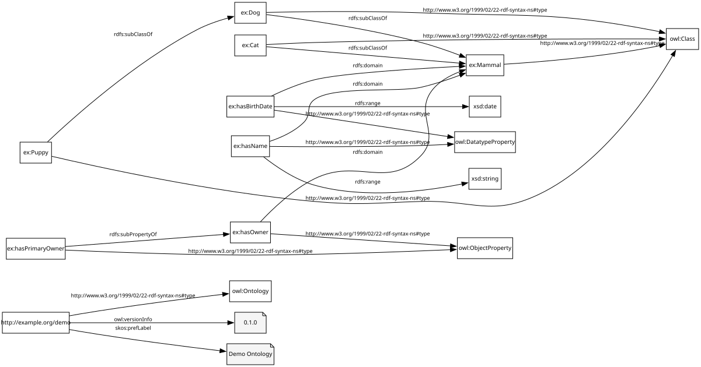
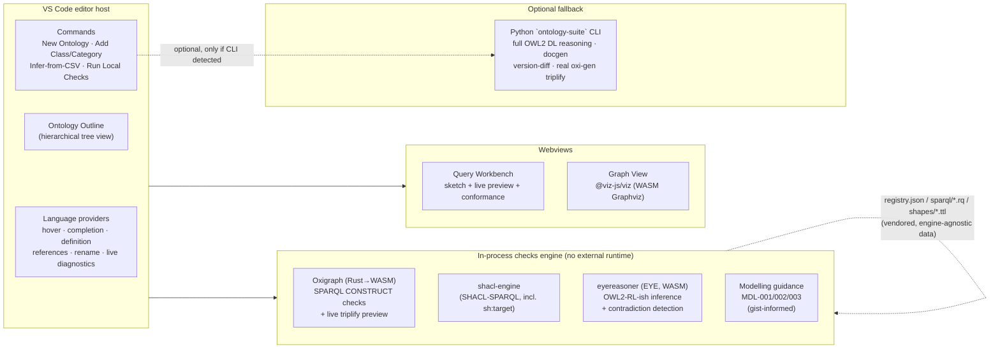

# Ontology Development Suite

A VS Code extension for creating ontologies (with `owl:imports`) and building
TARQL-style CSV → RDF data graphs, with live diagnostics, a local
SPARQL/SHACL/OWL2-RL checks engine, and DL-expressivity/OWL2-profile
metrics — all running in-process via WASM/JS, no Python or Java required
for the core workflow.

It grew out of two sibling projects: [`consolidated_ontology_suite`](../consolidated_ontology_suite)
(a mature Python CLI with a 50-check registry, reasoning, docgen, and the
real `oxi-gen` triplifier) and [`turtle-editor-viewer`](../turtle-editor-viewer)
(a browser-based Turtle/SPARQL editor). This extension reuses the check
registry's *data* (`registry.json` + `sparql/*.rq` + `shapes/*.ttl` —
vendored under `resources/checks-registry/`) directly, evaluated by
in-process engines instead of a Python subprocess, and treats the Python
CLI as an optional deep-validation fallback rather than a hard dependency.

> This is a from-scratch v1 build, not yet published to the Marketplace.
> Everything below has been verified against the `examples/` fixtures
> (see [Verification](#verification)) but has not been driven through a
> live VS Code GUI session in this environment — see
> [Try it](#try-it) for how to do that yourself.

## What you get

Open an ontology, ask for its graph, and get a real rendered SVG (this one
is generated straight from `examples/ontology/domain.ttl` by the extension's
own renderer, not a mockup):



The Ontology Outline (Explorer sidebar) shows classes and properties as a
nested, Protégé-style hierarchy — object and datatype properties kept as
separate subtrees — rather than a flat list:

```
▾ Classes (4)
  ▾ Mammal
      Cat
    ▾ Dog
        Puppy
▾ Object Properties (2)
  ▾ has owner
      has primary owner
▾ Datatype Properties (2)
    has birth date
    has name
```

## Architecture



Everything in **Local** and **Views** runs with zero external runtime
dependency — Oxigraph, `shacl-engine`, and `eyereasoner` are all
WASM/pure-JS. The Python CLI is detected via
`ontologySuite.pythonCliPath` (or PATH) and only used for the "Deep
Validation" and "Full Triplify" commands, degrading gracefully if absent.

## Features

**Ontology authoring**
- *New Ontology* wizard: base IRI, prefix, `owl:imports` picker (workspace
  ontologies + a curated list: gist, schema.org, SKOS, Dublin Core, PROV-O).
- *Add Class or Category*: asks whether a new term needs its own
  structure/relationships (→ `owl:Class`) or is just a classification
  (→ `gist:Category`) — see [Gist-informed guidance](#gist-informed-modelling-guidance).
  Does **not** auto-generate a paired inverse property by default.
- Import resolution is local-first, transitive, and matches both an
  ontology's identity IRI *and* its `owl:versionIRI`.

**TARQL-style triplification**
- *Infer Ontology + Query from CSV*: profiles a raw CSV (type/cardinality
  sniffing) and drafts both a starter ontology fragment and a CONSTRUCT
  query wired to it.
- *Query Workbench*: live, debounced preview of the query's real
  triplified output against sample CSV rows (via Oxigraph, TARQL semantics
  reproduced with a standard SPARQL `VALUES` injection), a static
  "sketch" of the CONSTRUCT template, and conformance warnings
  (undeclared classes/properties, prefix drift) against the ontology.
- *Run Full Triplify* shells out to the real `oxi-gen` binary (via the
  Python CLI) for production-scale output once a query is finalized.

**Validation**
- *Run Local Checks*: the registry's 39 SPARQL + 6 SHACL-SPARQL checks,
  OWL2-RL-ish inference/consistency, and gist-informed modelling guidance —
  merged into one Problems-panel view, entirely in-process.
- *Run Deep Validation*: optional Python CLI fallback for full OWL2 DL
  reasoning (owlready2/HermiT).
- Competency questions as VS Code tests: `.cq.rq` files (SPARQL ASK/SELECT
  + expected-result directives) show up in Test Explorer.

**Metrics**
- *Show Metrics & DL Expressivity*: OntoQA-style schema metrics (class/
  property counts, inheritance/relationship/attribute richness, hierarchy
  depth) plus a DL-expressivity label (`ALCHIQ(D)`-style) and OWL2
  EL/QL/RL profile-membership badges. Also shown live in the status bar.
  Ontologies are never restricted to a profile — this just shows where the
  ontology currently sits relative to each one, so you can develop in a
  lighter profile deliberately or use full OWL2 DL when you need the
  expressivity.

**Refactoring**
- Find-References and workspace-wide Rename for ontology terms, across
  `.ttl` and `.rq` files, backed by the same index used for completion and
  go-to-definition.

### Gist-informed modelling guidance

Three advisory (`Hint`-severity) rules grounded against Semantic Arts'
gist upper ontology (`ontologySuite.modellingGuidance`, default `"gist"`):

| Rule | What it flags |
|---|---|
| `MDL-001` | A named property declared solely as `owl:inverseOf` another named property — gist only ever scopes `owl:inverseOf` inline to one restriction, never as two top-level declared properties. |
| `MDL-002` | `owl:equivalentClass` between two plain named classes with no logical definition — usually should be `rdfs:subClassOf` or a SKOS mapping instead. |
| `MDL-003` | A class with no restrictions of its own — consider `gist:Category` instead, per gist's own scope note on the class. |

## Commands

| Command | What it does |
|---|---|
| Ontology Suite: New Ontology... | Scaffold a new `.ttl` file |
| Ontology Suite: Add Class or Category... | Insert a class or `gist:Category` individual |
| Ontology Suite: Add Property... | Insert an object/datatype/annotation property |
| Ontology Suite: Open Query Workbench | Live triplify preview for the active `.rq` file |
| Ontology Suite: Visualize Subject Graph | Render a subject's neighborhood as an SVG graph |
| Ontology Suite: Run Local Checks | In-process SPARQL/SHACL/reasoning/guidance run |
| Ontology Suite: Show Metrics & DL Expressivity | Schema metrics + expressivity report |
| Ontology Suite: Infer Ontology + Query from CSV... | Draft an ontology + query from a raw CSV |
| Ontology Suite: Run Deep Validation (Python CLI) | Optional full-OWL2-DL fallback |
| Ontology Suite: Run Full Triplify (Python CLI / oxi-gen) | Production-scale triplification |

## Settings

| Setting | Default | Purpose |
|---|---|---|
| `ontologySuite.modellingGuidance` | `"gist"` | `"gist"` or `"off"` |
| `ontologySuite.pythonCliPath` | `"ontology-suite"` | CLI executable for the optional fallback |
| `ontologySuite.checksRegistryPath` | `""` | Override the vendored registry with another checkout |
| `ontologySuite.triplifyPreviewSampleSize` | `20` | CSV rows sampled for the live preview |

## Try it

1. Open this folder in VS Code and press `F5` (runs `npm run compile` first,
   via `.vscode/launch.json`/`tasks.json`) — launches an Extension
   Development Host with the extension loaded.
2. In that window, open the `examples/` folder and try `ontology/domain.ttl`,
   `queries/animals.rq`, and the commands above.
3. Alternatively, install the packaged extension directly:
   `code --install-extension ontology-dev-suite-0.1.0.vsix` (built via
   `npx @vscode/vsce package`).

## Verification

Since driving the actual VS Code GUI isn't possible in the environment this
was built in, the core logic (import resolution, the checks engine, sketch/
prefix-alignment, the live triplify preview, CSV profiling, and the class/
property hierarchy builder) was verified with standalone Node scripts
against `examples/`, confirmed to produce correct, real output — not just
"compiles". `npm run typecheck`, `npm run lint`, and `npm run compile` all
pass clean.

## Packaging notes

`esbuild.js` bundles only this extension's own code; `node_modules` ships
as real files (`packages: 'external'` in the esbuild config) because
Oxigraph, `eyereasoner` (EYE/swipl-wasm), `shacl-engine`'s Comunica-lite
dependency tree, and `@viz-js/viz` all load WASM/native assets from paths
relative to their own package directory, which bundling would break. That
makes the packaged `.vsix` large (~28 MB compressed) for a VS Code
extension — a deliberate tradeoff for running every engine in-process with
zero external runtime dependency, rather than shelling out to Python/Java
for validation that a WASM/JS engine can do locally.

## Roadmap

Not yet built, tracked as deliberate follow-ups: docgen/version-diff
command wiring, web extension host (vscode.dev) support, upstreaming a
`--format json` report mode to `consolidated_ontology_suite`, a feasibility
check on compiling `oxi-gen` itself to WASM, and the further-out
differentiators (LLM-assisted authoring, synthesize-query-by-example, a
live semantic-version status-bar badge, a reactive `.ontonb` notebook).
