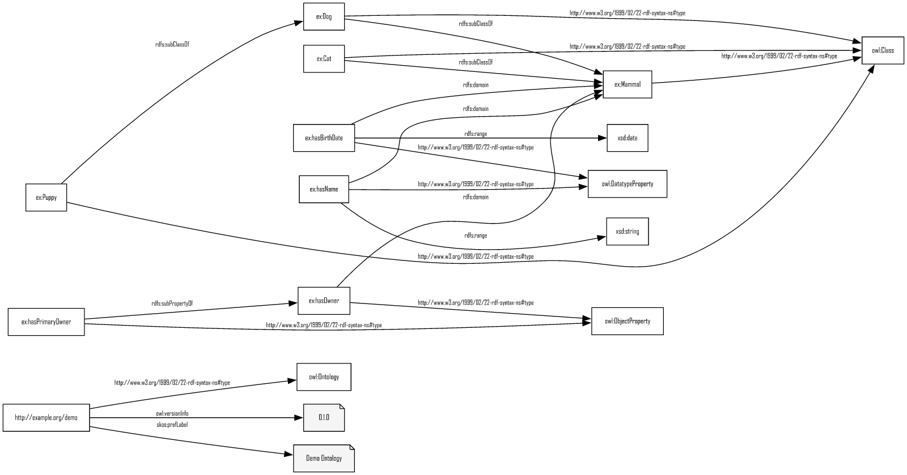
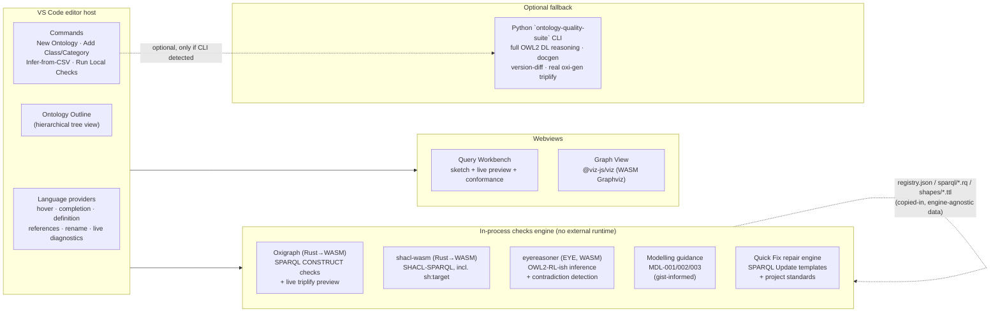

# Ontology Development Suite

A VS Code extension for creating ontologies (with `owl:imports`) and building
TARQL-style CSV → RDF data graphs, with live diagnostics, a local
SPARQL/SHACL/OWL2-RL checks engine, and DL-expressivity/OWL2-profile
metrics — all running in-process via WASM/JS, no Python or Java required
for the core workflow. Reads, writes, and converts between Turtle, TriG,
N-Triples, N-Quads, RDF/XML, and OWL Manchester Syntax (including real
class expressions — `and`/`or`/`not`/`some`/`only`/cardinality
restrictions — not just atomic declarations; see [Serializations](#serializations)).

It grew out of two sibling projects: `consolidated_ontology_suite`
(a mature Python CLI with a 56-check registry, reasoning, docgen, and the
real `oxi-gen` triplifier) and `turtle-editor-viewer`
(a browser-based Turtle/SPARQL editor). This extension reuses the check
registry's *data* (`registry.json` + `sparql/*.rq` + `shapes/*.ttl` —
copied into `resources/checks-registry/`) directly, evaluated by
in-process engines instead of a Python subprocess, and treats the Python
CLI as an optional deep-validation fallback rather than a hard dependency.

> Everything below has been verified against the `examples/` fixtures
> (see [Verification](#verification)) but has not been driven through a
> live VS Code GUI session in this environment — see
> [Try it](#try-it) for how to do that yourself.

## What you get

Open an ontology, ask for its graph, and get a real rendered SVG (this one
is generated straight from `examples/ontology/domain.ttl` by the extension's
own renderer, not a mockup):



The Ontology Outline (Explorer sidebar) shows classes and properties as a
nested, Protégé-style hierarchy — object and datatype properties kept as
separate subtrees — rather than a flat list:

```
▾ Classes (4)
  ▾ Mammal
      Cat
    ▾ Dog
        Puppy
▾ Object Properties (2)
  ▾ has owner
      has primary owner
▾ Datatype Properties (2)
    has birth date
    has name
```

## Architecture



Everything in **Local** and **Views** runs with zero external runtime
dependency — Oxigraph, `shacl-wasm`, and `eyereasoner` are all
WASM/pure-JS. The Python CLI is detected via
`ontologySuite.pythonCliPath` (or PATH) and only used for the "Deep
Validation" and "Full Triplify" commands, degrading gracefully if absent.

## Features

**Ontology authoring**
- *New Ontology* wizard: base IRI, prefix, `owl:imports` picker (workspace
  ontologies + a curated list: gist, schema.org, SKOS, Dublin Core, PROV-O)
  — each pick also gets its own `@prefix` binding inserted, not just the
  `owl:imports` line, so the file can use the vocabulary as CURIEs right away.
- *Add Class or Category*: asks whether a new term needs its own
  structure/relationships (→ `owl:Class`) or is just a classification
  (→ `gist:Category`) — see [Gist-informed guidance](#gist-informed-modelling-guidance).
  Does **not** auto-generate a paired inverse property by default.
- **Protégé-style Ontology Outline actions**: right-click (or use the inline
  `+` icon on hover) any class or property node — not just the file root —
  for *Add Subclass*, *Add Sibling Class* (inherits the sibling's own
  parent(s)), or *Add Sub-property* (object/datatype). *Add Subclass*
  optionally accepts a real Manchester class-expression restriction (e.g.
  `hasChild some Person`), parsed by the same engine `.omn` files use and
  asserted as an additional `rdfs:subClassOf [...]` restriction alongside
  the named parent. Drag a class/property onto another of the same kind to
  add it as an *additional* parent — deliberately never a destructive move
  (the dragged term keeps any parent(s) it already had); a confirmation
  message says so explicitly.
- Import resolution is local-first, transitive, and matches both an
  ontology's identity IRI *and* its `owl:versionIRI`.

**Scripting: build an ontology as code**
- *Run Ontology Script*: author a `.ontology.ts` file — a plain TypeScript
  file (full IntelliSense/type-checking, not a custom language) using a
  small DSL (`ontology-suite/dsl`: `defclass` (`subClassOf`,
  `equivalentClass`, `disjointWith`), `defobjectproperty`,
  `defdatatypeproperty`, and restriction-builders `some`/`only`/`and`/`or`/
  `not`/cardinality) — and run it to generate real Turtle. Inspired by
  [Tawny-OWL](https://github.com/phillord/tawny-owl)'s idea of using a real
  programming language's abstraction facilities (functions, loops) for
  ontology patterns instead of clicking through a GUI once per term.
- Runs in a forked child process, not the extension host — a real process
  boundary so a script bug can't take down the extension — and reuses the
  *exact* class-expression engine the Outline's Manchester-restriction
  option and `.omn` files already use for `some`/`only`/etc., so there's
  only one implementation of "class expression → RDF" in the whole
  extension, not a second one for scripts.
- Output is append-only by default (adds new statements to the target
  `.ttl`, same as every other scaffold command here) with an
  explicit-confirmation whole-file-replace option when the script is meant
  to be the canonical source.
- No separate testing framework needed: **Run Local Checks** and
  `.cq.rq` competency questions already validate *any* graph, script-generated
  or hand-authored — Tawny-OWL's "unit test framework with reasoning" is
  already covered by infrastructure this extension has for every other
  workflow.

**TARQL-style triplification**
- *Infer Ontology + Query from CSV*: profiles a raw CSV (type/cardinality
  sniffing) and drafts both a starter ontology fragment and a CONSTRUCT
  query wired to it.
- *Query Workbench*: live, debounced preview of the query's real
  triplified output against sample CSV rows (via Oxigraph, TARQL semantics
  reproduced with a standard SPARQL `VALUES` injection), a static
  "sketch" of the CONSTRUCT template, and conformance warnings
  (undeclared classes/properties, prefix drift) against the ontology.
  Query files may be `.rq`, `.sparql`, `.tq` or `.tarql`; the CSV is paired by
  filename stem, searching sibling directories as well as the query's own. The
  ontologies to check against are found in the query's own directory, then its
  parent, then its siblings — **all** of those found, since an extension
  ontology plus the upper ontology it builds on is the normal case — or pinned
  explicitly with `ontologySuite.queryOntologyPaths`.
- *Run Full Triplify* shells out to the real `oxi-gen` binary (via the
  Python CLI) for production-scale output once a query is finalized.

**Validation**
- *Run Local Checks*: the registry's 44 SPARQL + 6 SHACL-SPARQL checks,
  OWL2-RL-ish inference/consistency, gist-informed modelling guidance, a
  closed-world vocabulary check (`VOC-001`, see below), and this project's
  own [minimum-required-content rules](#project-rules-minimum-required-content) —
  merged into one Problems-panel view, entirely in-process.
- **`VOC-001` (closed-world vocabulary check)**: SHACL's open-world
  semantics never flag "used `ex:Dgo`, meant `ex:Dog`" — nothing
  *contradicts* an undeclared class/property existing, it's just never
  asserted to. `VOC-001` walks every triple's predicate (always a property
  reference) and, for a fixed set of term-referencing predicates
  (`rdf:type`, `rdfs:subClassOf`/`subPropertyOf`/`domain`/`range`,
  `owl:equivalentClass`/`disjointWith`/`inverseOf`/restriction predicates,
  `sh:targetClass`/`class`/`path`), its object too, flagging any IRI that
  isn't declared anywhere in the document or its resolved imports.
  Scoped to namespaces the graph has *some* closed-world knowledge of —
  at least one declared term already exists there — so an external
  vocabulary that was never actually imported (`dcterms:`, `foaf:`, or
  `gist:` when it isn't imported here) is left alone rather than flooded
  with false positives; `rdf:`/`rdfs:`/`owl:`/`sh:`/`skos:`/`xsd:` are
  excluded the same way, automatically. Toggle via
  `ontologySuite.enableVocabularyChecks` (default on).
- *Review TARQL BIND Consistency*: `TQL-001`/`TQL-002`/`TQL-003` over a whole
  folder of CONSTRUCT queries — the one variable minted two different ways in
  two files, and the constructed-IRI variable a template uses but nothing ever
  binds. Both are invisible in either file alone: each query is valid, each
  produces triples, and the two IRIs for what should be one node simply never
  join. Findings land on the queries in the Problems panel, and the reviewer’s
  side-by-side report goes to the *TARQL BIND Review* output channel. Available
  from the palette with a query open, or on any folder in the explorer’s context
  menu. [docs/TESTING_TARQL.md](docs/TESTING_TARQL.md) covers what these three
  catch, what nothing here catches, and a review order.
- *Run Deep Validation*: optional Python CLI fallback for full OWL2 DL
  reasoning (owlready2/HermiT).
- Competency questions as VS Code tests: `.cq.rq` files (SPARQL ASK/SELECT
  + expected-result directives) show up in Test Explorer.
- *Quick Fix*: 16 checks (see [Quick Fix](#quick-fix-schematron-quick-fix-style-repair))
  offer a one-click lightbulb repair, computed from a real SPARQL Update
  and completed by this project's own `.ontology-suite/standards.json`
  where relevant — nothing is ever written without an explicit
  "Apply Fix" confirmation showing the exact triples that will change.

**Metrics**
- *Show Metrics & DL Expressivity*: OntoQA-style schema metrics (class/
  property counts, inheritance/relationship/attribute richness, hierarchy
  depth) plus a DL-expressivity label (`ALCHIQ(D)`-style) and OWL2
  EL/QL/RL profile-membership badges. Also shown live in the status bar.
  Ontologies are never restricted to a profile — this just shows where the
  ontology currently sits relative to each one, so you can develop in a
  lighter profile deliberately or use full OWL2 DL when you need the
  expressivity.

**Visualization**
- *Visualize Subject Graph*: a subject-neighborhood SVG rendered via
  `@viz-js/viz` (the real Graphviz WASM build, not a mockup/screenshot),
  scroll/pinch-to-zoom and drag-to-pan in the webview (a small hand-rolled
  CSS-transform viewport — no bundled pan/zoom library, since the
  webview's CSP only allows its own nonce'd inline script). Node
  shapes/colors match `turtle-editor-viewer`'s own graph renderer: rounded
  boxes, blue literals, orange blank nodes.
- Four toggles for decluttering a large neighborhood: hide `rdf:type`
  edges, hide annotation edges (`rdfs:label`/`comment`, `skos:definition`/
  `example`), hide `rdfs:isDefinedBy` edges specifically, and **hide
  imported terms' downstream** — an imported class/property referenced by
  the document still appears as a leaf (so you can see *that* it's used),
  but none of *its own* further connections from the imported ontology are
  pulled in. Plus a layout-direction dropdown (`LR`/`RL`/`TB`/`BT`).
- **Show inferred (reasoner closure)** — runs the same EYE reasoner as
  *Run Local Checks* against the current neighborhood and overlays whatever
  additional triples it derives (e.g. a subclass-chain-entailed `rdf:type`)
  as dashed purple edges, alongside the asserted graph's normal solid
  edges. The reasoner's own internal bookkeeping triples (used to explain
  `REA-DISJOINT`/`REA-SAMEDIFF` findings) are filtered out first, so only
  genuine domain-level inferences are shown. Computed once per panel and
  cached — later toggles/redraws don't re-run the reasoner.
- **Download SVG** or **Download PNG** — PNG rasterization runs via
  `@resvg/resvg-wasm` in the extension host (Graphviz's own WASM build has
  no PNG output at all — confirmed, only vector/text formats), with a
  bundled Roboto font (`resources/fonts/`, SIL OFL 1.1) supplied
  explicitly, since `resvg-wasm`'s system-font loading finds nothing in
  this WASM/Node context and would otherwise silently render blank text
  with no error. Saving a PNG also opens it in a new editor tab, so
  download and view are the same action.

**Editing assistance**
- Autocomplete in `.ttl`/`.rq` is *position-aware*: after `a`/`rdf:type` it
  suggests classes only; in predicate position, properties only; after
  `rdfs:subClassOf`/`rdfs:domain`/`rdfs:range`/`owl:equivalentClass`,
  classes only; after `rdfs:subPropertyOf`/`owl:inverseOf`, properties only
  — instead of dumping every class/property/individual in the namespace
  into one list regardless of where the cursor is
  (`language/completionContext.ts`, a lightweight statement-position
  heuristic, not a full parser — fails open to "show everything" for
  anything it can't confidently classify, e.g. inside nested `[ ... ]`
  blank-node property lists).
- Autocomplete in `.omn` (Manchester Syntax) — previously none at all:
  prefix completion, section-aware term completion (`SubClassOf:`/
  `Types:` suggest classes *and* properties, since a class expression can
  start with either; `Domain:`/`Range:` suggest classes only;
  `SubPropertyOf:` suggests properties only), and class-expression keyword
  completion (`and`/`or`/`not`/`some`/`only`/`value`/`Self`/`min`/`max`/
  `exactly`) wherever a class expression is being written
  (`language/manchesterSection.ts` + `manchesterCompletion.ts`).
- Hover shows label/kind/comment/definition/domain/range/subClassOf for
  any term, or flags it as undeclared.

**Refactoring**
- Find-References and workspace-wide Rename for ontology terms, across
  `.ttl` and `.rq` files, backed by the same index used for completion and
  go-to-definition.
- *Sort Document* (Alphabetically / By Type) and *Clean Document* (removes
  unused `@prefix` declarations, then sorts by type: ontology header,
  classes, object properties, datatype properties, individuals — each
  group alphabetical within itself). Splits the document into per-statement
  text blocks and only ever reorders them — never reparses/reformats a
  statement's own text — so comments and hand formatting survive; a
  comment directly above a term (no blank line between) moves with it,
  while a blank-line-separated comment (e.g. a file header) floats as a
  pinned preamble instead of migrating with whichever block sorts first.
  Confirmed lossless at the RDF level and idempotent by its own test suite
  against a real fixture. Turtle only (`.ttl`) — TriG's `GRAPH { ... }`
  blocks aren't `.`-terminated the same way, so this doesn't attempt them.
  Declines (rather than guessing) on a document with a syntax error.

### Gist-informed modelling guidance

Three advisory (`Hint`-severity) rules grounded against Semantic Arts'
gist upper ontology (`ontologySuite.modellingGuidance`, default `"gist"`):

| Rule | What it flags |
|---|---|
| `MDL-001` | A named property declared solely as `owl:inverseOf` another named property — gist only ever scopes `owl:inverseOf` inline to one restriction, never as two top-level declared properties. |
| `MDL-002` | `owl:equivalentClass` between two plain named classes with no logical definition — usually should be `rdfs:subClassOf` or a SKOS mapping instead. |
| `MDL-003` | A class with no restrictions of its own — consider `gist:Category` instead, per gist's own scope note on the class. |

### Quick Fix: Schematron-Quick-Fix-style repair

16 checks (`STR-001/002/005/007/008`, `QUA-001/002/004/005/007`,
`LOG-003`, `MDL-001/002/003`, `STY-003`, `PRJ-REQUIRED`) offer a real
Quick Fix, the same idea as Schematron Quick Fix (SQF): the fix is
declared alongside the check and draws on the same context the check's
own finding already carries (`focusNode`/`path`/`value`), plus this
project's own configuration where a fix needs a project-specific value —
e.g. `MDL-003`'s "retype this class-with-no-structure as a category"
fix uses *your* project's category class from
`.ontology-suite/standards.json`, defaulting to `gist:Category` only if
you haven't configured one.

Every fix is preview-then-apply: selecting a Quick Fix opens a modal
listing the exact triples it would add/remove before anything is
written — there is no auto-apply or "fix all" path. Fixes that only add
triples are appended as a new Turtle block, preserving the rest of the
file's formatting/comments exactly; fixes that also remove an existing
triple reserialize the whole document instead (can't in general splice a
deletion into arbitrary hand-authored syntax) and say so explicitly in
the confirmation modal. A fix only ever touches the *currently open*
document's own triples — never an imported file — and safely no-ops if
its target triple isn't actually present there.

### Project rules: minimum required content

`.ontology-suite/class-rules.json` (path configurable via
`ontologySuite.projectRulesPath`) declares "every resource of this type
needs these predicates" rules as plain JSON, autocompleted/validated by
VS Code's built-in JSON language support (a bundled schema is wired
through `contributes.jsonValidation` — no SHACL/Turtle authoring
needed):

```json
{
  "rules": [
    { "appliesTo": "owl:Class", "requires": ["rdfs:label"] },
    { "appliesTo": "owl:ObjectProperty", "requires": ["rdfs:label", "rdfs:domain", "rdfs:range"] }
  ]
}
```

Findings (`PRJ-REQUIRED`) flow through the same diagnostics/Quick-Fix
pipeline as every other check — a missing `rdfs:label`/`skos:prefLabel`
is auto-fixable (derives a label from the local name); structural
predicates like `rdfs:domain`/`rdfs:range` have no safe machine-
generated value, so those are correctly flagged with no Quick Fix
offered.

## Serializations

Six formats, both directions, via `rdf/serialization.ts`:

| Format | Extension | Read/write via | Round-trips |
|---|---|---|---|
| Turtle | `.ttl` | N3.js | Losslessly |
| TriG | `.trig` | N3.js | Losslessly |
| N-Triples | `.nt` | N3.js | Losslessly |
| N-Quads | `.nq`/`.nquads` | N3.js | Losslessly |
| RDF/XML | `.rdf` | `rdfxml-streaming-parser` (read) + hand-written writer (no `@rdfjs/serializer-rdfxml` exists) | Losslessly |
| OWL Manchester Syntax | `.omn` | hand-written tokenizer/parser/writer (no npm package exists at all) | OWL-axiom subset only |

Manchester Syntax gets real class-expression support, not just atomic
class names: `SubClassOf: hasOwner some Person`, `EquivalentTo: Dog and
(hasOwner some Person)`, cardinality restrictions, `{individual, sets}`,
etc. — a hand-rolled recursive-descent parser for the (compact,
well-specified) Manchester expression grammar, translating to/from the
standard OWL2-in-RDF blank-node encoding
(`owl:intersectionOf`/`someValuesFrom`/`onProperty`/...). It's still a
deliberately-scoped subset of full Manchester Syntax — declarations,
annotations, domain/range, subClassOf/equivalentClass with class
expressions, individual types — property characteristics and data-range
expressions aren't covered, which is why `FORMATS.manchester.
losslessGraph` is `false` where every other format is `true`.

`.owl` is content-sniffed rather than assumed (Protégé defaults it to
RDF/XML; plenty of hand-authored `.owl` files are actually Turtle).

**Convert / Save As Serialization...** converts the active document to any
other format and opens the result — warns first if the target is lossy.

## Commands

| Command | What it does |
|---|---|
| Ontology Suite: New Ontology... | Scaffold a new `.ttl` file |
| Ontology Suite: Add Class or Category... | Insert a class or `gist:Category` individual |
| Ontology Suite: Add Property... | Insert an object/datatype/annotation property |
| Ontology Suite: Open Query Workbench | Live triplify preview for the active `.rq` file |
| Ontology Suite: Visualize Subject Graph | Render a subject's neighborhood as an SVG graph |
| Ontology Suite: Run Local Checks | In-process SPARQL/SHACL/reasoning/guidance run |
| Ontology Suite: Show Metrics & DL Expressivity | Schema metrics + expressivity report |
| Ontology Suite: Infer Ontology + Query from CSV... | Draft an ontology + query from a raw CSV |
| Ontology Suite: Run Deep Validation (Python CLI) | Optional full-OWL2-DL fallback |
| Ontology Suite: Run Full Triplify (Python CLI / oxi-gen) | Production-scale triplification |
| Ontology Suite: Generate Documentation (Python CLI) | HTML reference docs (classes/properties/diagrams) via `ontology-quality-suite docgen` |
| Ontology Suite: Convert / Save As Serialization... | Convert the active document to another format |
| Ontology Suite: Run Ontology Script (.ontology.ts) | Build/extend an ontology from a TypeScript DSL script |
| Ontology Suite: Sort Document (Alphabetically / By Type) | Reorder statements, comment-preserving |
| Ontology Suite: Clean Document | Remove unused prefixes, then sort by type |

Right-click actions in the Ontology Outline (Add Subclass, Add Sibling
Class, Add Sub-property) aren't in the Command Palette — they need the
tree node you clicked as context, so they only appear in the Outline's
own right-click menu / inline hover icon.

## Configuration

Two different mechanisms, for two different kinds of customization:

- **VS Code settings** (`ontologySuite.*`, table below) — behavioral toggles: what runs, how
  fast, which fallback CLI to use. Set these per-person (**File → Preferences → Settings**,
  or `Ctrl+,`/`Cmd+,`, searching `ontologySuite`) if they're about *your own* editing
  preferences, or per-project (the Workspace tab in that same Settings UI, which writes to
  `.vscode/settings.json`) if the whole team should share them — commit
  `.vscode/settings.json` to get everyone on the same checks/CLI configuration automatically.
- **Project config files** (`.ontology-suite/*.json`, workspace-relative, paths themselves
  configurable via the two `*Path` settings below) — not VS Code settings at all, just plain
  JSON files meant to be committed alongside the ontology they apply to, so the whole team
  (and CI, if it also runs this suite) sees the same project standards/rules. See
  [Quick Fix](#quick-fix-schematron-quick-fix-style-repair) and
  [Project rules](#project-rules-minimum-required-content) above for what goes in each.

| Setting | Default | Purpose |
|---|---|---|
| `ontologySuite.modellingGuidance` | `"gist"` | `"gist"` or `"off"` — advisory MDL-001/002/003 hints |
| `ontologySuite.pythonCliPath` | `"ontology-quality-suite"` | CLI executable for the optional deep-validation/docgen/version-diff fallback — see the [Appendix](#appendix-configuring-ontologysuite-settings) for how to set it and how to get a working CLI in the first place |
| `ontologySuite.checksRegistryPath` | `""` | Point at your own registry.json/sparql/shapes checkout instead of the bundled copy — e.g. to add project-specific SPARQL/SHACL checks beyond what `class-rules.json` can express |
| `ontologySuite.enableSparqlChecks` | `true` | Run the registry's SPARQL CONSTRUCT checks. Fast (~0.2s on this project's own fixtures) |
| `ontologySuite.enableShaclChecks` | `true` | Run the registry's SHACL-SPARQL shapes (via `shacl-wasm-node`). Fast since 0.10.0 — ~0.3s for all six shapes files where the previous `shacl-engine` took ~71s — so there is rarely a reason to turn it off now |
| `ontologySuite.disabledChecks` | `[]` | Check ids to suppress in *Run Local Checks*, e.g. `["QUA-009", "QUA-010"]`. A disabled check’s SPARQL query is not run at all, and findings for the id are dropped whichever engine reported them |
| `ontologySuite.enableVocabularyChecks` | `true` | Run the closed-world vocabulary check (`VOC-001`) — flags used-but-undeclared class/property IRIs (typos, hallucinated terms) within namespaces the graph has closed-world knowledge of |
| `ontologySuite.queryOntologyPaths` | `[]` | Ontology file(s) a query is checked for conformance against. Each entry is a literal path **or** a glob (`*`, `?`, `**`), mixed freely in one list — e.g. `["core.ttl", "vocab/*_ontology.ttl"]`. Absolute or workspace-relative. Empty = discover automatically (query's own directory, then parent, then siblings). All resolved ontologies are merged |
| `ontologySuite.triplifyPreviewSampleSize` | `20` | CSV rows sampled for the live triplify preview |
| `ontologySuite.maxIndexedFileSizeKb` | `5120` | Files larger than this are not parsed into the term index, so their terms do not appear in hover, completion, go-to-definition or rename. A multi-MB data graph costs seconds of blocked editor to index terms nobody hovers; hand-authored ontologies are far below the default (gist core is under 1 MB). Skipped files are named in the extension host log |
| `ontologySuite.projectStandardsPath` | `.ontology-suite/standards.json` | Project values (category class, language tag, versioning, policy) that complete Quick Fix repairs |
| `ontologySuite.projectRulesPath` | `.ontology-suite/class-rules.json` | Minimum-required-content rules for classes/properties (`PRJ-REQUIRED`) |

**Personalizing to yourself**: things like `pythonCliPath` (if your CLI lives somewhere
non-standard) or turning off `enableShaclChecks` while iterating quickly on a large ontology
belong in your User settings — they're about your machine/workflow, not the project's rules.

**Personalizing to your project**: `.ontology-suite/standards.json` and
`.ontology-suite/class-rules.json` are the two files actually meant to travel with the
ontology in version control — `modellingGuidance`/`checksRegistryPath` are also natural
Workspace-settings candidates if the whole team should see the same behavior (e.g. a team
that doesn't use gist turning `modellingGuidance` to `"off"` in committed
`.vscode/settings.json`, so nobody has to remember to do it locally).

**If "Open Query Workbench" says "Open a .rq CONSTRUCT query file first" even though a `.rq`
file is open**: another installed RDF/SPARQL extension is also claiming the `.rq` extension for
its own language (confirmed concretely against `faubulous.mentor`, which registers a `sparql`
language for both `.rq` and `.sparql`) — check the language-mode indicator in the status bar; if
it doesn't say "SPARQL CONSTRUCT", VS Code resolved the conflict the other way. Every command
here that touches `.rq` files gates on the exact `sparql-construct` languageId, so this isn't
fixable from this extension's manifest alone — the fix is a `files.associations` entry, which
this repo's own `.vscode/settings.json` already sets:
```json
"files.associations": { "*.rq": "sparql-construct", "*.sparql": "sparql-construct" }
```

## Try it

1. Open this folder in VS Code and press `F5` (runs `npm run compile` first,
   via `.vscode/launch.json`/`tasks.json`) — launches an Extension
   Development Host with the extension loaded.
2. In that window, open `examples/tutorial/` and work through
   **[TUTORIAL.md](TUTORIAL.md)** — every feature, step by step, against a
   coherent example ontology plus a real gist v11→v14.1 upstream-migration
   scenario.
3. Alternatively, install a packaged build directly — grab the `.vsix` from
   the [latest release](https://github.com/pwin/consolidated-ontology-quality-suite-webapp/releases/latest),
   or build one yourself with `npx @vscode/vsce package`:
   `code --install-extension ontology-dev-suite-0.13.1.vsix`

## Publishing to the Marketplace

The manifest is Marketplace-ready (publisher `pwin`, 128×128 icon, keywords,
gallery banner, repository/homepage/bugs links, and no `private` flag — which
`vsce` refuses to publish past). What is left is account setup, which cannot
live in the repo:

1. Sign in to [dev.azure.com](https://dev.azure.com) with a Microsoft account
   and create a Personal Access Token scoped to **Marketplace → Manage**, for
   **all accessible organisations**.
2. Create the publisher `pwin` at
   [marketplace.visualstudio.com/manage](https://marketplace.visualstudio.com/manage)
   — the ID must match `package.json`'s `publisher` exactly.
3. Publish the artifact that was already built and verified, rather than
   rebuilding:
   ```sh
   npx @vscode/vsce login pwin
   npx @vscode/vsce publish --packagePath ontology-dev-suite-0.13.1.vsix
   ```

`engines.vscode` is currently `^1.125.0`, so the Marketplace will only offer
the extension to that build or newer — worth lowering deliberately if wider
reach matters more than the newest API surface.

[Open VSX](https://open-vsx.org) (what VSCodium, Gitpod and Cursor use) is a
separate registry with its own publish step, `npx ovsx publish`.

## Testing

Two tiers, both real and both passing as of this writing:

- **`npm test`** (Vitest) — 216 tests across 34 files covering every
  pure-logic module: parsing, all six serializations' round-trips
  (including the Manchester class-expression engine against real OWL2
  restrictions), import resolution (including the gist v11→v14.1 drift-
  and-fix scenario below), the checks engine (SPARQL/SHACL/reasoning/
  guidance/project rules), the Quick Fix repair engine (every template,
  both policy branches of `LOG-003`/`MDL-002`, the cross-file safe-no-op
  case), the Ontology Outline's Protégé-style subclass/sibling/sub-property
  rendering (including the Manchester-restriction round-trip), the
  scripting DSL (defclass/defobjectproperty/restriction-builders,
  `disjointWith`/`equivalentClass`, a real loop-generated class family),
  triplification (sketch/conformance/live-preview/CSV profiling), the
  completion-position heuristics, and the graph view's DOT generation
  (every toggle/rankdir option, plus the inferred-edge dashed-purple
  styling and its literal-aware `quadKey()` diffing) and PNG rasterization
  (a real pixel-content check, not just PNG-signature validity — the check
  that would have caught the blank-text font bug before it shipped). Fast
  (~10-15s), no VS Code required.
- **`npm run test:integration`** (`@vscode/test-cli` + `@vscode/test-electron`)
  — launches a real, headless VS Code Extension Development Host and
  exercises the actual extension: activation, command registration,
  language assignment, and a full **Run Local Checks** run against
  `examples/tutorial/clinic.ttl` asserting real diagnostics land in the
  Problems panel. Slower (~35s) and requires downloading a VS Code test
  binary on first run.

Both suites — and the manual walkthrough in `TUTORIAL.md` — use the same
`examples/` fixtures, so nothing in the tutorial is aspirational; if it's
described as working, a test asserts it.

Building this test suite surfaced two real bugs, both fixed (see
`CHANGELOG.md`): the then-current `shacl-engine` crashing on some check
shapes against a real ontology (contained via per-shapes-file isolation,
and gone outright since 0.10.0 replaced that engine), and `findPair` not
searching sibling `csv/`/`queries/` directories (the exact layout every
example fixture in this repo uses, including the ones that shipped in
0.1.0 — meaning the Query Workbench's live preview never actually found
its paired CSV until this was caught by a test).

## Packaging notes

`esbuild.js` bundles only this extension's own code; `node_modules` ships
as real files (`packages: 'external'` in the esbuild config) because
Oxigraph, `eyereasoner` (EYE/swipl-wasm), `shacl-wasm-node` and
`@viz-js/viz` all load WASM/native assets from paths relative to their own
package directory, which bundling would break. That
makes the packaged `.vsix` large (~19 MB compressed) for a VS Code
extension — a deliberate tradeoff for running every engine in-process with
zero external runtime dependency, rather than shelling out to Python/Java
for validation that a WASM/JS engine can do locally.

## Roadmap

Not yet built, tracked as deliberate follow-ups: version-diff command
wiring (docgen itself is now wired, see Commands above), web extension
host (vscode.dev) support, upstreaming a `--format json` report mode to
`consolidated_ontology_suite`, a feasibility check on compiling `oxi-gen`
itself to WASM, and the further-out differentiators (LLM-assisted
authoring, synthesize-query-by-example, a live semantic-version
status-bar badge, a reactive `.ontonb` notebook).

## Appendix: Configuring `ontologySuite.*` settings

The [Configuration](#configuration) section above covers *what* each setting is
for and the User-vs-Workspace scoping decision; this covers the mechanics of
actually setting one, and the practical detail behind each.

### How to set any of them

- **Settings UI** — `Ctrl+,`/`Cmd+,` (or Command Palette → "Preferences: Open
  Settings (UI)"), search `ontologySuite`, and use the field directly (a
  dropdown for `modellingGuidance`'s two-value enum, checkboxes for the
  `enable*Checks` booleans, text fields for paths). The UI has a **User** /
  **Workspace** tab at the top — which one you're editing determines where
  the value is written.
- **`settings.json` directly** — Command Palette → "Preferences: Open User
  Settings (JSON)" (your machine, every workspace) or "Preferences: Open
  Workspace Settings (JSON)" (this project only, writes to
  `.vscode/settings.json`, which travels with the repo in version control if
  committed — this project's own `.vscode/settings.json` already sets
  `files.associations` for `.rq`/`.sparql`, see the Query Workbench
  troubleshooting note above). Every entry is `"ontologySuite.<name>": <value>`,
  e.g.:
  ```json
  {
    "ontologySuite.modellingGuidance": "off",
    "ontologySuite.enableShaclChecks": false,
    "ontologySuite.pythonCliPath": "C:\\repos\\consolidated_ontology_suite\\.venv\\Scripts\\ontology-suite.exe"
  }
  ```
- **Precedence**: Workspace overrides User for anyone opening that workspace, same as every other VS Code setting.

### Setting-by-setting notes

- **`pythonCliPath`** (default `"ontology-quality-suite"`, a bare command name) —
  used only by the three commands that shell out to the Python CLI (*Run
  Deep Validation*, *Run Full Triplify*, *Generate Documentation*); every
  other command here is in-process JS/WASM and ignores this entirely. It's
  passed straight to Node's `child_process.spawn()` (`src/cli/ontologySuiteClient.ts`,
  through a shell on Windows so `.exe`/`.cmd` PATH shims resolve normally), so:
  - Leave it as the default if `ontology-quality-suite` is already on your
    `PATH` (typical right after `pip install -e .` from
    `consolidated_ontology_suite` into whichever Python environment is
    currently active).
  - **Set it to `"ontology-suite"` if your install predates that project
    renaming itself** — the console script changed name, and an older
    checkout still provides the old one. Through v0.13.1 this default *was*
    the old name, so the three CLI-backed commands could not launch at all
    against a current install.
  - Set it to a **full path** if the CLI lives in a specific virtualenv not
    on your global `PATH`, e.g.
    `"C:\\repos\\consolidated_ontology_suite\\.venv\\Scripts\\ontology-quality-suite.exe"`
    (Windows) or `"/path/to/venv/bin/ontology-quality-suite"` (macOS/Linux).
  - This setting alone doesn't get you a working CLI — a real Python
    interpreter has to exist and `consolidated_ontology_suite` has to
    actually be installed into it first. Worth checking directly: the
    Windows Store's `python`/`python3` app-execution-alias stubs (which
    exist by default on a fresh Windows install and only print an
    "install from the Store" prompt) are easy to mistake for a real
    interpreter being present when it isn't.
- **`checksRegistryPath`** (default `""`, meaning "use the bundled copy") —
  point at another `consolidated_ontology_suite` checkout's root (the
  directory containing `registry.json`/`sparql/`/`shapes/`) to add
  project-specific checks beyond what `class-rules.json` can express. A
  relative path is resolved against the workspace root.
- **`projectStandardsPath`** / **`projectRulesPath`** (defaults
  `.ontology-suite/standards.json` / `.ontology-suite/class-rules.json`) —
  workspace-relative paths; these two are the ones actually meant to be
  committed to version control alongside the ontology, not set as personal
  User settings (see [Project rules](#project-rules-minimum-required-content)).
- **`modellingGuidance`** (`"gist"` | `"off"`) and the three
  **`enable*Checks`** booleans are plain toggles, no path resolution
  involved — see the [Configuration](#configuration) table above for what
  each actually runs and its cost.
- **`triplifyPreviewSampleSize`** (default `20`) — a plain number of CSV
  rows; larger values make the Query Workbench's live preview slower to
  recompute on every debounced edit, with diminishing returns past what's
  needed to sanity-check the query's shape.

### Setting up the Python CLI itself (`consolidated_ontology_suite`)

`pythonCliPath` only does anything once a real Python environment with
`consolidated_ontology_suite` actually installed exists. The project ships
its own `pyproject.toml` (`[project.scripts] ontology-suite = "ontology_suite.cli:main"`)
and a `uv.lock`, so [uv](https://docs.astral.sh/uv/) is the path of least
resistance — it manages its own Python (no system interpreter required at
all) and installs from the lock in one step:

```sh
cd consolidated_ontology_suite
uv sync
```

This creates `.venv/` in that directory and installs the exact locked
versions (30 packages, incl. `rdflib`/`pyshacl`/`owlready2`/`owlrl`/`pandas`/
`matplotlib`). Verified directly while writing this doc — `uv sync` +
`ontology-quality-suite docgen --ontology .../clinic.ttl --instances .../instances.ttl
--ref .../core.ttl --out-dir ...` produced a real 1,388-line
`ontology-documentation.html` with 9 class diagrams, not a dry read of the
source. Point `pythonCliPath` at the venv it creates:

```json
{ "ontologySuite.pythonCliPath": "C:\\repos\\consolidated_ontology_suite\\.venv\\Scripts\\ontology-suite.exe" }
```
(macOS/Linux: `.../consolidated_ontology_suite/.venv/bin/ontology-suite`.)

**Without `uv`** — a plain `venv` + `pip` works the same way; a
`requirements.txt` (`uv export --format requirements-txt --no-hashes`, kept
alongside `pyproject.toml` in `consolidated_ontology_suite` for exactly this
case) is the pinned-version equivalent of `pyproject.toml`'s dependency list,
for anyone whose workflow expects one instead of `pip install -e .`:

```sh
cd consolidated_ontology_suite
python -m venv .venv
.venv\Scripts\activate          # macOS/Linux: source .venv/bin/activate
pip install -r requirements.txt
```

One gotcha this surfaced directly: a fresh Windows machine's `python`/`python3`
on `PATH` may resolve to the Windows Store's app-execution-alias stub, which
only prints an "install from the Store" prompt rather than running anything —
easy to mistake for a real interpreter being present when it isn't. `uv sync`
sidesteps this entirely since `uv` fetches and manages its own Python.
