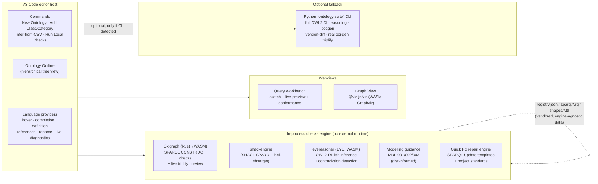

# Ontology Development Suite

A VS Code extension for creating ontologies (with `owl:imports`) and building
TARQL-style CSV → RDF data graphs, with live diagnostics, a local
SPARQL/SHACL/OWL2-RL checks engine, and DL-expressivity/OWL2-profile
metrics — all running in-process via WASM/JS, no Python or Java required
for the core workflow. Reads, writes, and converts between Turtle, TriG,
N-Triples, N-Quads, RDF/XML, and OWL Manchester Syntax (including real
class expressions — `and`/`or`/`not`/`some`/`only`/cardinality
restrictions — not just atomic declarations; see [Serializations](#serializations)).

It grew out of two sibling projects: `consolidated_ontology_suite`
(a mature Python CLI with a 50-check registry, reasoning, docgen, and the
real `oxi-gen` triplifier) and `turtle-editor-viewer`
(a browser-based Turtle/SPARQL editor). This extension reuses the check
registry's *data* (`registry.json` + `sparql/*.rq` + `shapes/*.ttl` —
vendored under `resources/checks-registry/`) directly, evaluated by
in-process engines instead of a Python subprocess, and treats the Python
CLI as an optional deep-validation fallback rather than a hard dependency.

> This is a from-scratch v1 build, not yet published to the Marketplace.
> Everything below has been verified against the `examples/` fixtures
> (see [Verification](#verification)) but has not been driven through a
> live VS Code GUI session in this environment — see
> [Try it](#try-it) for how to do that yourself.

## What you get

Open an ontology, ask for its graph, and get a real rendered SVG (this one
is generated straight from `examples/ontology/domain.ttl` by the extension's
own renderer, not a mockup):


The Ontology Outline (Explorer sidebar) shows classes and properties as a
nested, Protégé-style hierarchy — object and datatype properties kept as
separate subtrees — rather than a flat list:

```
▾ Classes (4)
  ▾ Mammal
      Cat
    ▾ Dog
        Puppy
▾ Object Properties (2)
  ▾ has owner
      has primary owner
▾ Datatype Properties (2)
    has birth date
    has name
```

## Architecture



Everything in **Local** and **Views** runs with zero external runtime
dependency — Oxigraph, `shacl-engine`, and `eyereasoner` are all
WASM/pure-JS. The Python CLI is detected via
`ontologySuite.pythonCliPath` (or PATH) and only used for the "Deep
Validation" and "Full Triplify" commands, degrading gracefully if absent.

## Features

**Ontology authoring**
- *New Ontology* wizard: base IRI, prefix, `owl:imports` picker (workspace
  ontologies + a curated list: gist, schema.org, SKOS, Dublin Core, PROV-O).
- *Add Class or Category*: asks whether a new term needs its own
  structure/relationships (→ `owl:Class`) or is just a classification
  (→ `gist:Category`) — see [Gist-informed guidance](#gist-informed-modelling-guidance).
  Does **not** auto-generate a paired inverse property by default.
- Import resolution is local-first, transitive, and matches both an
  ontology's identity IRI *and* its `owl:versionIRI`.

**TARQL-style triplification**
- *Infer Ontology + Query from CSV*: profiles a raw CSV (type/cardinality
  sniffing) and drafts both a starter ontology fragment and a CONSTRUCT
  query wired to it.
- *Query Workbench*: live, debounced preview of the query's real
  triplified output against sample CSV rows (via Oxigraph, TARQL semantics
  reproduced with a standard SPARQL `VALUES` injection), a static
  "sketch" of the CONSTRUCT template, and conformance warnings
  (undeclared classes/properties, prefix drift) against the ontology.
- *Run Full Triplify* shells out to the real `oxi-gen` binary (via the
  Python CLI) for production-scale output once a query is finalized.

**Validation**
- *Run Local Checks*: the registry's 39 SPARQL + 6 SHACL-SPARQL checks,
  OWL2-RL-ish inference/consistency, gist-informed modelling guidance, and
  this project's own [minimum-required-content rules](#project-rules-minimum-required-content) —
  merged into one Problems-panel view, entirely in-process.
- *Run Deep Validation*: optional Python CLI fallback for full OWL2 DL
  reasoning (owlready2/HermiT).
- Competency questions as VS Code tests: `.cq.rq` files (SPARQL ASK/SELECT
  + expected-result directives) show up in Test Explorer.
- *Quick Fix*: 16 checks (see [Quick Fix](#quick-fix-schematron-quick-fix-style-repair))
  offer a one-click lightbulb repair, computed from a real SPARQL Update
  and completed by this project's own `.ontology-suite/standards.json`
  where relevant — nothing is ever written without an explicit
  "Apply Fix" confirmation showing the exact triples that will change.

**Metrics**
- *Show Metrics & DL Expressivity*: OntoQA-style schema metrics (class/
  property counts, inheritance/relationship/attribute richness, hierarchy
  depth) plus a DL-expressivity label (`ALCHIQ(D)`-style) and OWL2
  EL/QL/RL profile-membership badges. Also shown live in the status bar.
  Ontologies are never restricted to a profile — this just shows where the
  ontology currently sits relative to each one, so you can develop in a
  lighter profile deliberately or use full OWL2 DL when you need the
  expressivity.

**Editing assistance**
- Autocomplete in `.ttl`/`.rq` is *position-aware*: after `a`/`rdf:type` it
  suggests classes only; in predicate position, properties only; after
  `rdfs:subClassOf`/`rdfs:domain`/`rdfs:range`/`owl:equivalentClass`,
  classes only; after `rdfs:subPropertyOf`/`owl:inverseOf`, properties only
  — instead of dumping every class/property/individual in the namespace
  into one list regardless of where the cursor is
  (`language/completionContext.ts`, a lightweight statement-position
  heuristic, not a full parser — fails open to "show everything" for
  anything it can't confidently classify, e.g. inside nested `[ ... ]`
  blank-node property lists).
- Autocomplete in `.omn` (Manchester Syntax) — previously none at all:
  prefix completion, section-aware term completion (`SubClassOf:`/
  `Types:` suggest classes *and* properties, since a class expression can
  start with either; `Domain:`/`Range:` suggest classes only;
  `SubPropertyOf:` suggests properties only), and class-expression keyword
  completion (`and`/`or`/`not`/`some`/`only`/`value`/`Self`/`min`/`max`/
  `exactly`) wherever a class expression is being written
  (`language/manchesterSection.ts` + `manchesterCompletion.ts`).
- Hover shows label/kind/comment/definition/domain/range/subClassOf for
  any term, or flags it as undeclared.

**Refactoring**
- Find-References and workspace-wide Rename for ontology terms, across
  `.ttl` and `.rq` files, backed by the same index used for completion and
  go-to-definition.

### Gist-informed modelling guidance

Three advisory (`Hint`-severity) rules grounded against Semantic Arts'
gist upper ontology (`ontologySuite.modellingGuidance`, default `"gist"`):

| Rule | What it flags |
|---|---|
| `MDL-001` | A named property declared solely as `owl:inverseOf` another named property — gist only ever scopes `owl:inverseOf` inline to one restriction, never as two top-level declared properties. |
| `MDL-002` | `owl:equivalentClass` between two plain named classes with no logical definition — usually should be `rdfs:subClassOf` or a SKOS mapping instead. |
| `MDL-003` | A class with no restrictions of its own — consider `gist:Category` instead, per gist's own scope note on the class. |

### Quick Fix: Schematron-Quick-Fix-style repair

16 checks (`STR-001/002/005/007/008`, `QUA-001/002/004/005/007`,
`LOG-003`, `MDL-001/002/003`, `STY-003`, `PRJ-REQUIRED`) offer a real
Quick Fix, the same idea as Schematron Quick Fix (SQF): the fix is
declared alongside the check and draws on the same context the check's
own finding already carries (`focusNode`/`path`/`value`), plus this
project's own configuration where a fix needs a project-specific value —
e.g. `MDL-003`'s "retype this class-with-no-structure as a category"
fix uses *your* project's category class from
`.ontology-suite/standards.json`, defaulting to `gist:Category` only if
you haven't configured one.

Every fix is preview-then-apply: selecting a Quick Fix opens a modal
listing the exact triples it would add/remove before anything is
written — there is no auto-apply or "fix all" path. Fixes that only add
triples are appended as a new Turtle block, preserving the rest of the
file's formatting/comments exactly; fixes that also remove an existing
triple reserialize the whole document instead (can't in general splice a
deletion into arbitrary hand-authored syntax) and say so explicitly in
the confirmation modal. A fix only ever touches the *currently open*
document's own triples — never an imported file — and safely no-ops if
its target triple isn't actually present there.

### Project rules: minimum required content

`.ontology-suite/class-rules.json` (path configurable via
`ontologySuite.projectRulesPath`) declares "every resource of this type
needs these predicates" rules as plain JSON, autocompleted/validated by
VS Code's built-in JSON language support (a bundled schema is wired
through `contributes.jsonValidation` — no SHACL/Turtle authoring
needed):

```json
{
  "rules": [
    { "appliesTo": "owl:Class", "requires": ["rdfs:label"] },
    { "appliesTo": "owl:ObjectProperty", "requires": ["rdfs:label", "rdfs:domain", "rdfs:range"] }
  ]
}
```

Findings (`PRJ-REQUIRED`) flow through the same diagnostics/Quick-Fix
pipeline as every other check — a missing `rdfs:label`/`skos:prefLabel`
is auto-fixable (derives a label from the local name); structural
predicates like `rdfs:domain`/`rdfs:range` have no safe machine-
generated value, so those are correctly flagged with no Quick Fix
offered.

## Serializations

Six formats, both directions, via `rdf/serialization.ts`:

| Format | Extension | Read/write via | Round-trips |
|---|---|---|---|
| Turtle | `.ttl` | N3.js | Losslessly |
| TriG | `.trig` | N3.js | Losslessly |
| N-Triples | `.nt` | N3.js | Losslessly |
| N-Quads | `.nq`/`.nquads` | N3.js | Losslessly |
| RDF/XML | `.rdf` | `rdfxml-streaming-parser` (read) + hand-written writer (no `@rdfjs/serializer-rdfxml` exists) | Losslessly |
| OWL Manchester Syntax | `.omn` | hand-written tokenizer/parser/writer (no npm package exists at all) | OWL-axiom subset only |

Manchester Syntax gets real class-expression support, not just atomic
class names: `SubClassOf: hasOwner some Person`, `EquivalentTo: Dog and
(hasOwner some Person)`, cardinality restrictions, `{individual, sets}`,
etc. — a hand-rolled recursive-descent parser for the (compact,
well-specified) Manchester expression grammar, translating to/from the
standard OWL2-in-RDF blank-node encoding
(`owl:intersectionOf`/`someValuesFrom`/`onProperty`/...). It's still a
deliberately-scoped subset of full Manchester Syntax — declarations,
annotations, domain/range, subClassOf/equivalentClass with class
expressions, individual types — property characteristics and data-range
expressions aren't covered, which is why `FORMATS.manchester.
losslessGraph` is `false` where every other format is `true`.

`.owl` is content-sniffed rather than assumed (Protégé defaults it to
RDF/XML; plenty of hand-authored `.owl` files are actually Turtle).

**Convert / Save As Serialization...** converts the active document to any
other format and opens the result — warns first if the target is lossy.

## Commands

| Command | What it does |
|---|---|
| Ontology Suite: New Ontology... | Scaffold a new `.ttl` file |
| Ontology Suite: Add Class or Category... | Insert a class or `gist:Category` individual |
| Ontology Suite: Add Property... | Insert an object/datatype/annotation property |
| Ontology Suite: Open Query Workbench | Live triplify preview for the active `.rq` file |
| Ontology Suite: Visualize Subject Graph | Render a subject's neighborhood as an SVG graph |
| Ontology Suite: Run Local Checks | In-process SPARQL/SHACL/reasoning/guidance run |
| Ontology Suite: Show Metrics & DL Expressivity | Schema metrics + expressivity report |
| Ontology Suite: Infer Ontology + Query from CSV... | Draft an ontology + query from a raw CSV |
| Ontology Suite: Run Deep Validation (Python CLI) | Optional full-OWL2-DL fallback |
| Ontology Suite: Run Full Triplify (Python CLI / oxi-gen) | Production-scale triplification |
| Ontology Suite: Convert / Save As Serialization... | Convert the active document to another format |

## Settings

| Setting | Default | Purpose |
|---|---|---|
| `ontologySuite.modellingGuidance` | `"gist"` | `"gist"` or `"off"` |
| `ontologySuite.pythonCliPath` | `"ontology-suite"` | CLI executable for the optional fallback |
| `ontologySuite.checksRegistryPath` | `""` | Override the vendored registry with another checkout |
| `ontologySuite.triplifyPreviewSampleSize` | `20` | CSV rows sampled for the live preview |
| `ontologySuite.projectStandardsPath` | `.ontology-suite/standards.json` | Project values (category class, language tag, versioning, policy) that complete Quick Fix repairs |
| `ontologySuite.projectRulesPath` | `.ontology-suite/class-rules.json` | Minimum-required-content rules for classes/properties (`PRJ-REQUIRED`) |

## Try it

1. Open this folder in VS Code and press `F5` (runs `npm run compile` first,
   via `.vscode/launch.json`/`tasks.json`) — launches an Extension
   Development Host with the extension loaded.
2. In that window, open `examples/tutorial/` and work through
   **[TUTORIAL.md](TUTORIAL.md)** — every feature, step by step, against a
   coherent example ontology plus a real gist v11→v14.1 upstream-migration
   scenario.
3. Alternatively, install the packaged extension directly:
   `code --install-extension ontology-dev-suite-0.3.0.vsix` (build it with
   `npx @vscode/vsce package`).

## Testing

Two tiers, both real and both passing as of this writing:

- **`npm test`** (Vitest) — 121 tests across 25 files covering every
  pure-logic module: parsing, all six serializations' round-trips
  (including the Manchester class-expression engine against real OWL2
  restrictions), import resolution (including the gist v11→v14.1 drift-
  and-fix scenario below), the checks engine (SPARQL/SHACL/reasoning/
  guidance/project rules), the Quick Fix repair engine (every template,
  both policy branches of `LOG-003`/`MDL-002`, the cross-file safe-no-op
  case), triplification (sketch/conformance/live-preview/CSV profiling),
  and the completion-position heuristics. Fast (~10-15s), no VS Code
  required.
- **`npm run test:integration`** (`@vscode/test-cli` + `@vscode/test-electron`)
  — launches a real, headless VS Code Extension Development Host and
  exercises the actual extension: activation, command registration,
  language assignment, and a full **Run Local Checks** run against
  `examples/tutorial/clinic.ttl` asserting real diagnostics land in the
  Problems panel. Slower (~35s) and requires downloading a VS Code test
  binary on first run.

Both suites — and the manual walkthrough in `TUTORIAL.md` — use the same
`examples/` fixtures, so nothing in the tutorial is aspirational; if it's
described as working, a test asserts it.

Building this test suite surfaced two real bugs, both fixed (see
`CHANGELOG.md`): `shacl-engine` crashing on some check shapes against a
real ontology (fixed via per-shapes-file isolation), and `findPair` not
searching sibling `csv/`/`queries/` directories (the exact layout every
example fixture in this repo uses, including the ones that shipped in
0.1.0 — meaning the Query Workbench's live preview never actually found
its paired CSV until this was caught by a test).

## Packaging notes

`esbuild.js` bundles only this extension's own code; `node_modules` ships
as real files (`packages: 'external'` in the esbuild config) because
Oxigraph, `eyereasoner` (EYE/swipl-wasm), `shacl-engine`'s Comunica-lite
dependency tree, and `@viz-js/viz` all load WASM/native assets from paths
relative to their own package directory, which bundling would break. That
makes the packaged `.vsix` large (~28 MB compressed) for a VS Code
extension — a deliberate tradeoff for running every engine in-process with
zero external runtime dependency, rather than shelling out to Python/Java
for validation that a WASM/JS engine can do locally.

## Roadmap

Not yet built, tracked as deliberate follow-ups: docgen/version-diff
command wiring, web extension host (vscode.dev) support, upstreaming a
`--format json` report mode to `consolidated_ontology_suite`, a feasibility
check on compiling `oxi-gen` itself to WASM, and the further-out
differentiators (LLM-assisted authoring, synthesize-query-by-example, a
live semantic-version status-bar badge, a reactive `.ontonb` notebook).
